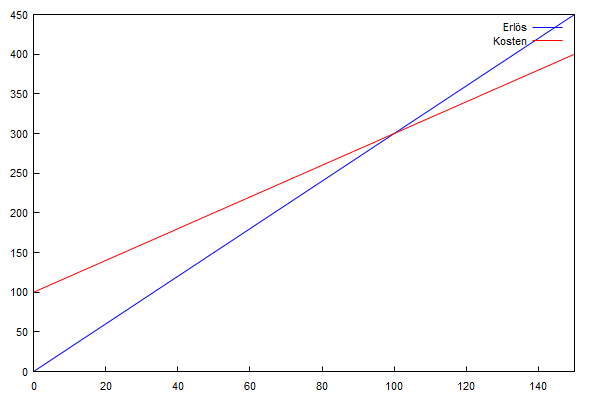

# Illustrierte Lösung

## 	Aufgabenstellung
​	Die Produktion eines Gutes verursacht Fixkosten in der Höhe von 100.
​	Die variablen Kosten belaufen sich auf 2 pro Stück. Der Verkaufspreis
​	beträgt 3 pro Stück.

## 	Gleichung: 

​				$ e=v+f $

